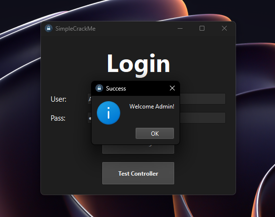

# SimpleCrackMe

<div align="center">
  
  <h3>A Simple Crackable Application</h3>
</div>

## 🔐 Challenge

Welcome to SimpleCrackMe! This is a simple authentication challenge for beginners interested in reverse engineering and application security.

### Your Goal

<div align="center">
  
</div>

Your mission is to find a valid username and password combination to successfully log in to the application. The credentials are randomly generated each time the application starts, making this a perfect exercise for those learning about reverse engineering techniques.

## 🚀 Getting Started

### Prerequisites

- Python 3.11 or higher
- PySide6

### Installation

1. Clone the repository:
   ```bash
   git clone https://github.com/randomname124290358349/SimpleCrackMe.git
   cd SimpleCrackMe
   ```

2. Install required dependencies:
   ```bash
   pip install -r requirements.txt
   ```

3. Run the application:
   ```bash
   python main.py
   ```

### Pre-built Binary

If you prefer using a pre-built executable, download the latest release from the [Releases](https://github.com/randomname124290358349/SimpleCrackMe/releases) page.

## 💡 Hints

<details>
<summary>Need a hint? Click here!</summary>

1. The application uses a Model-View-Controller (MVC) architecture.
2. Look for where and how the user credentials are generated.
3. Finding a way to inspect the application's memory during runtime might be helpful.
4. Try to understand how the authentication logic works.

</details>

## 🛠️ Technical Details

<details>
<summary>Code Explanation (SPOILER WARNING!)</summary>

### Architecture

This application follows the Model-View-Controller (MVC) architectural pattern:

- **Model (`UserModel`)**: Manages data, logic, and rules of the application
- **View (`MainWindow`)**: Handles the user interface and user interactions
- **Controllers (`LoginController`, `TestController`)**: Process user input and update the model/view accordingly

### Authentication System

The authentication system uses a simple in-memory dictionary to store user credentials. The interesting part is that the username and password are randomly generated each time the application starts:

```python
def __init__(self):
    ascii_letters_and_numbers = [_ for _ in 'abcdefghijklmnopqrstuvwxyzABCDEFGHIJKLMNOPQRSTUVWXYZ1234567890']
    random_user = "".join([choice(ascii_letters_and_numbers) for _ in range(10)])
    random_pass = "".join([choice(ascii_letters_and_numbers) for _ in range(10)])
    self.users = {
        random_user: {"password": random_pass, "name": "Admin", "role": "admin"},
    }
    self.current_user = None
```

This makes each instance unique, requiring users to analyze the running application rather than the static code.

### Security Vulnerabilities

The primary vulnerability in this application is that the credentials are stored in memory as plaintext. A proper reverse engineering tool can be used to scan the application's memory and find these credentials.

### UI Implementation

The UI is implemented using PySide6 (Qt for Python) with a simple login form. The application uses signals and slots to communicate between the UI components and the controllers.

</details>

## 🔧 Building from Source

To build the executable yourself:

```bash
pip install pyinstaller
pyinstaller --name=SimpleCrackMe --onefile --windowed --add-data "resources;resources" --icon=resources/icons/icon.ico main.py
```

The project includes a GitHub Actions workflow (see `build.yml`) that automatically builds Windows executables for each tagged release.


## 🙏 Acknowledgments

- Built with [PySide6](https://wiki.qt.io/Qt_for_Python)
